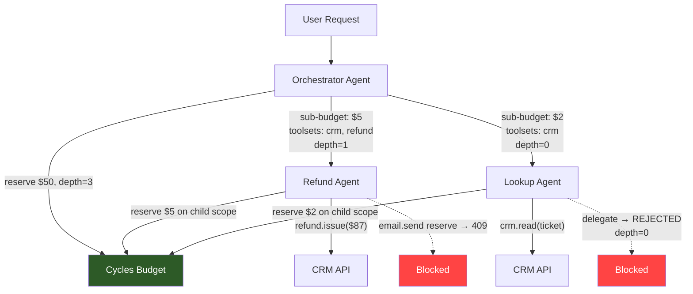

# Agent Delegation Chains Need Authority Attenuation, Not Trust Propagation

> **Part of: [AI Agent Risk & Blast Radius Reference](/guides/risk-and-blast-radius)** — the full pillar covering action authority, risk scoring, blast-radius containment, and degradation paths.

A planning agent delegates a research task to a retrieval agent. The retrieval agent delegates a web search to a browsing agent. The browsing agent calls an API with the planning agent's full credentials, its entire budget, and permission to write to any tool the parent could access. Three hops in a multi-agent delegation chain, zero scope reduction. This is how most multi-agent systems work today — and it's why a single compromised sub-agent can drain your budget, exfiltrate data, or trigger actions the original user never authorized. The [documented incident patterns](/blog/state-of-ai-agent-incidents-2026) keep repeating: unchecked authority in delegation chains is the common thread.

<!-- more -->

Google DeepMind researchers proposed an [intelligent delegation framework](https://arxiv.org/abs/2602.11865) in February. CSA warned in March that [delegation chains multiply access](https://cloudsecurityalliance.org/blog/2026/03/25/control-the-chain-secure-the-system-fixing-ai-agent-delegation) unless permissions are scoped. Microsoft shipped a [governance toolkit](https://opensource.microsoft.com/blog/2026/04/02/introducing-the-agent-governance-toolkit-open-source-runtime-security-for-ai-agents/) this week with pre-execution policy checks. The gap is no longer awareness. The gap is runtime attenuation: we have yet to see a general-purpose enforcement primitive that attenuates **budget, action scope, and delegation depth together** at every hop.

That primitive is **authority attenuation**: every delegation boundary must narrow what the child agent can spend, do, and access — never widen it. Budget, action permissions, and data scope should decrease monotonically through the chain. If you're unfamiliar with the concept, [runtime authority](/blog/what-is-runtime-authority-for-ai-agents) is the pre-execution control layer that decides whether an agent's next action proceeds. Authority attenuation extends that concept across delegation boundaries. This isn't a new idea in systems design (capability-based security has enforced it for decades), but the agent ecosystem hasn't assembled the pieces into a single enforcement pattern.

## Why delegation chains are an authority problem, not a trust problem

The industry frames multi-agent delegation as a trust question: *can I trust Agent B to do what Agent A asked?* This framing leads to identity verification, reputation scores, and attestation chains. All useful — all insufficient.

The real question is: *even if Agent B is perfectly trustworthy, what should it be allowed to do?*

A trusted agent with excessive authority is still dangerous. It can be [prompt-injected via tool poisoning](/blog/mcp-tool-poisoning-why-agent-frameworks-cant-prevent-it). Its tool calls can have [unintended side effects](/blog/ai-agent-action-control-hard-limits-side-effects) that cost more than the [tokens](/glossary#tokens). Its sub-agents can amplify a small permission into a large blast radius. Trust answers "who" — authority answers "what" and "how much."

Consider a customer support orchestrator that delegates to a refund agent:

| Property | Orchestrator | Refund Agent (current) | Refund Agent (attenuated) |
|----------|-------------|----------------------|--------------------------|
| Budget | $50.00 | $50.00 (inherited) | $5.00 (sub-budget) |
| Actions | CRM read, CRM write, email, refund | CRM read, CRM write, email, refund (inherited) | CRM read, refund ≤ $100 |
| Data scope | All customers | All customers (inherited) | Current ticket customer only |
| Delegation depth | Unlimited | Unlimited (inherited) | 0 (terminal — cannot delegate further) |

The left column is what ships today. The right column is what should ship. The difference is not trust — the refund agent is the same code either way. The difference is authority boundaries enforced at the delegation point.

## The attenuation pattern: sub-budgets, action masks, and depth limits

Authority attenuation requires three enforcement mechanisms at every delegation boundary.

### 1. Sub-budget carving

When Agent A delegates to Agent B, it reserves a portion of its own budget as Agent B's ceiling. Agent B cannot spend more than that sub-budget, regardless of what the parent has available.

```python
import uuid
from runcycles import (
    CyclesClient, CyclesConfig, ReservationCreateRequest,
    Subject, Amount, Unit,
)

client = CyclesClient(CyclesConfig.from_env())

# Orchestrator reserves against the workflow scope — $50 budget allocated there
orchestrator_res = client.create_reservation(ReservationCreateRequest(
    idempotency_key=str(uuid.uuid4()),
    subject=Subject(tenant="acme-corp", workflow="support"),
    estimate=Amount(unit=Unit.USD_MICROCENTS, amount=5_000_000_000),  # $50.00
))

# Delegate to refund agent — a SEPARATE reservation on a narrower scope.
# The "agent" field adds a deeper scope: tenant:acme-corp/workflow:support/agent:refund
# A budget of $5 must be explicitly allocated at that scope via the Admin API.
refund_res = client.create_reservation(ReservationCreateRequest(
    idempotency_key=str(uuid.uuid4()),
    subject=Subject(
        tenant="acme-corp",
        workflow="support",
        agent="refund",
        dimensions={"run": "ticket-4821"},
    ),
    estimate=Amount(unit=Unit.USD_MICROCENTS, amount=500_000_000),  # $5.00
))

# The refund agent's world is bounded by BOTH its agent-level budget ($5)
# AND the parent workflow budget ($50). If either is exhausted, the live reservation
# is rejected. A prompt-injected loop burns at most the agent-level allocation.
```

The key concept: Cycles budgets are **independent at each scope level** — they do not automatically propagate from parent to child. You must explicitly allocate a budget at the child scope (e.g. `tenant:acme-corp/workflow:support/agent:refund`) via the Admin API. A [reservation](/glossary#reservation) then checks **every derived scope atomically** — the child scope's allocation and the parent scope's allocation must both have room. This is what makes attenuation enforceable: the child's ceiling is set by its own allocation, not inherited from the parent.

### 2. Toolset-scoped exposure budgets

Budget attenuation caps spend. Tool permissions cap capability. At each delegation boundary, the orchestrator defines which categories of tool calls the child is allowed to make. Cycles can add an independently enforced exposure budget for the categories that the orchestrator submits.

Cycles supports this through [**toolset-scoped budgets**](/concepts/action-authority-controlling-what-agents-do) — separate `RISK_POINTS` allocations for different tool categories within the same agent:

```python
from runcycles import Action  # noqa: E402 (shown separately for clarity)

# The refund agent gets TWO toolset-scoped RISK_POINTS budgets via Admin API:
#   tenant:acme-corp/workflow:support/agent:refund/toolset:refund  → 20 RISK_POINTS
#   tenant:acme-corp/workflow:support/agent:refund/toolset:crm     → 5 RISK_POINTS
#   tenant:acme-corp/workflow:support/agent:refund/toolset:email   → 0 RISK_POINTS
# The email row is an explicit zero-allocation ledger, not an absent ledger.

# When the refund agent issues a refund:
refund_res = client.create_reservation(ReservationCreateRequest(
    idempotency_key=str(uuid.uuid4()),
    subject=Subject(
        tenant="acme-corp", workflow="support",
        agent="refund", toolset="refund",
    ),
    estimate=Amount(unit=Unit.RISK_POINTS, amount=20),
    action=Action(kind="tool.call", name="refund.issue"),
))
# Allowed — 20 risk points fit within the refund toolset's budget.

# When the refund agent tries to send an email:
email_res = client.create_reservation(ReservationCreateRequest(
    idempotency_key=str(uuid.uuid4()),
    subject=Subject(
        tenant="acme-corp", workflow="support",
        agent="refund", toolset="email",
    ),
    estimate=Amount(unit=Unit.RISK_POINTS, amount=10),
    action=Action(kind="tool.call", name="email.send"),
))
# Rejected with 409 BUDGET_EXCEEDED — the email ledger explicitly allocates 0.
```

The toolset scope gives the application an exposure boundary: the refund agent has budget on `toolset:refund` and `toolset:crm`, while an explicitly provisioned ledger allocates zero to `toolset:email`. It doesn't matter how many risk points remain overall — a submitted `email.send` reservation is rejected by that zero-allocation ledger. If the email ledger were absent instead, the reference server would skip that scope and enforce only other applicable ledgers. The orchestrator must still restrict the child's tool inventory and validate parameters such as "refund ≤ $100"; Cycles accounts for the caller-assigned category and amount.

### 3. Depth limits

Every delegation chain needs a maximum depth. Without it, Agent B can delegate to Agent C, which delegates to Agent D, creating unbounded recursion that multiplies latency, cost, and blast radius.

```
Orchestrator (depth=3)
  └─ Refund Agent (depth=2)
       └─ CRM Lookup Agent (depth=1)
            └─ [BLOCKED — depth=0, cannot delegate]
```

Depth limits are metadata on the delegation, enforced by your orchestration layer. Pass a `max_depth` integer when spawning each child agent; decrement it at each hop. If a depth-0 agent attempts to spin up a sub-agent, the orchestrator rejects it before the child is created. Cycles doesn't enforce depth natively — this is logic you own — but it pairs naturally with budget attenuation: a depth-0 agent with a tight risk-point allocation has nowhere to go even if the depth check is bypassed.

## What the architecture looks like

Here's the full pattern — an orchestrator delegating to two specialist agents, each with attenuated authority:



The orchestrator holds the total budget. Each delegated agent gets an explicitly provisioned sub-budget, an orchestrator-restricted tool set, and a decremented depth counter. Cycles enforces the submitted spend and exposure budgets at the protocol level before execution. Tool inventory, parameter authorization, and depth limiting remain orchestration logic. Together, those mechanisms bound a compromised or misbehaving sub-agent at the mandatory execution boundary.

## Why the industry keeps getting this wrong

Three architectural defaults push multi-agent systems toward full trust propagation:

**1. Credential inheritance.** Multi-agent frameworks make broad delegation easy; least-privilege narrowing is something you must design explicitly. LangChain, CrewAI, and AutoGen all support per-agent tool configuration, but the path of least resistance is to pass the parent's full tool set to child agents. Dynamic tool switching exists — you *can* restrict what a sub-agent sees — but nothing in these frameworks enforces that you *do*.

**2. No budget hierarchy.** Orchestration frameworks don't model budget as a hierarchical resource. There's no concept of "this sub-agent gets 10% of my remaining budget." Without hierarchical scoping, every agent in the chain competes for the same flat pool — or has no budget at all. We covered the framework-specific gaps in [multi-agent budget control for CrewAI, AutoGen, and OpenAI Agents SDK](/blog/multi-agent-budget-control-crewai-autogen-openai-agents-sdk).

**3. Depth is implicit.** Delegation depth is controlled by prompt instructions ("do not delegate this task further"), not by runtime enforcement. Prompt-based depth limits fail the moment a sub-agent is jailbroken or encounters an edge case the prompt didn't anticipate. The result is [cascading failures that compound through each layer](/blog/why-multi-agent-systems-fail-87-percent-cost-of-every-coordination-breakdown), turning a $3 run into a $40 recovery sequence.

Microsoft's new Agent Governance Toolkit addresses credential scoping and action policies, but delegates budget enforcement to external systems. DeepMind's delegation framework is a theoretical model without runtime primitives. The CSA's recommendations are policy guidance without enforcement code. Each piece is necessary; none is sufficient alone.

## Implementing attenuation today

You don't need to wait for frameworks to ship attenuation primitives. The pattern works with any [runtime authority](/glossary#runtime-authority) system that supports hierarchical scopes.

**Step 1: Model your delegation tree using Cycles' Subject hierarchy.**

Map each delegation level to a Subject field. The orchestrator operates at the `workflow` level; each delegated agent adds an `agent` field to create a deeper scope:

```
tenant:acme-corp/workflow:support                          ← orchestrator
tenant:acme-corp/workflow:support/agent:refund             ← delegated agent
tenant:acme-corp/workflow:support/agent:lookup             ← delegated agent
```

For an enforceable per-run budget, encode a run identifier in one of the six standard Subject fields—for example, `workflow="run-ticket-4821"`. Keep the business workflow name in application metadata if you use `workflow` for the run. Do not put a run budget in `dimensions`: the reference server does not derive budget scopes from custom dimensions.

**Step 2: Allocate budgets at each agent scope via the Admin API.** Cycles budgets are independent at each scope level — they do not cascade. Set a `USD_MICROCENTS` budget and a `RISK_POINTS` budget at each agent scope, sized to the maximum the delegated agent should ever spend or do.

**Step 3: Reserve against the agent scope at delegation time.** Before spawning a child agent, call `create_reservation` with a `Subject` that includes the agent field. The reservation is checked atomically against every derived scope — both the agent-level and workflow-level budgets must have room.

**Step 4: Pair tool permissions with toolset-scoped exposure budgets.** Use a [risk assessment](/blog/ai-agent-risk-assessment-score-classify-enforce-tool-risk) to assign `RISK_POINTS` to each tool category. Restrict the child's actual tool inventory in the orchestrator, then provision matching toolset ledgers. To block submitted email reservations through budgeting, create the `toolset:email` ledger with an explicit zero allocation; an absent ledger is skipped.

**Step 5: Enforce depth in your orchestration logic.** Pass a `max_depth` counter that decrements at each delegation. At depth 0, the agent runs in terminal mode — no sub-agent creation. This is application logic, not a Cycles primitive, but it complements budget attenuation.

**Step 6: Release unused reservations.** When a delegated agent completes, call `release` on its reservation to return unused budget to the pool at every affected scope. This prevents budget fragmentation across deep chains.

## The Monday morning takeaway

If you're building multi-agent systems, audit your delegation boundaries this week. Ask three questions at every point where one agent spawns or calls another:

1. **Does the child agent get a smaller budget than the parent?** If not, a [runaway child can drain the entire run](/blog/runaway-demo-agent-cost-blowup-walkthrough).
2. **Does the child agent have fewer action permissions than the parent?** If not, a compromised child can do everything the parent can.
3. **Is there a hard depth limit enforced by your orchestration logic — not by a prompt?** If not, recursive delegation can amplify any failure.

If the answer to any of these is "no," you don't have a delegation chain — you have a trust propagation chain. And trust propagation chains are one prompt injection away from an incident.

Authority should attenuate through delegation chains the same way it attenuates through capability systems, OAuth scope restrictions, and Unix process permissions. The orchestrator narrows tool and data permissions and provisions smaller Cycles budgets for each child. Every enforcement point must be mandatory rather than merely suggested in a prompt.

## Related how-to guides

- [Assigning RISK_POINTS to agent tools](/how-to/assigning-risk-points-to-agent-tools)
- [Budget control for LangChain](/how-to/how-to-add-budget-control-to-a-langchain-agent)
- [Integrating with OpenAI](/how-to/integrating-cycles-with-openai)
