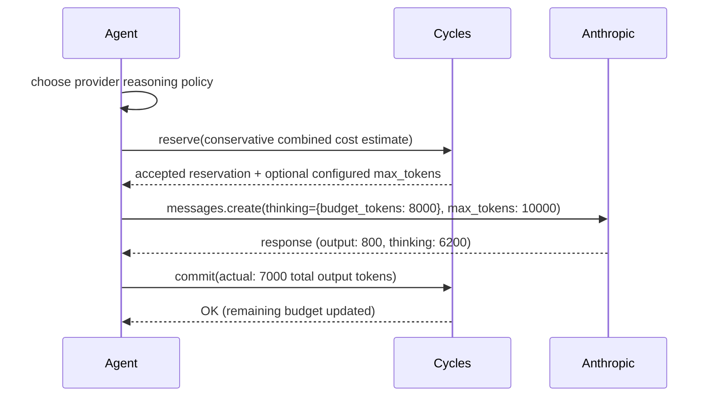

# Budgeting Reasoning Tokens Before They Bill

Consider a constructed migration from `claude-3-5-sonnet` to `claude-sonnet-4-6` with manual extended thinking enabled. The team raises `max_tokens` to 40,000, configures a 32,000-token thinking budget, and deploys without adding thinking usage to its cost estimator. The visible answers remain short, but the billed output now includes internal reasoning. The exact multiplier depends on prompts, cache behavior, and model pricing; the failure mode is that the runtime budget still estimates only visible output.

<!-- more -->

Reasoning models — current Claude adaptive-thinking models and earlier manual-thinking models, OpenAI reasoning models, Gemini thinking, and DeepSeek R1 — expose different per-call controls. Anthropic uses either `budget_tokens` or adaptive `effort` depending on the model; OpenAI uses `reasoning.effort` plus an output ceiling; Gemini 2.5 supports `thinkingBudget`. If a production budget estimator sees only visible output length, its reservations can bear little relationship to the amount ultimately billed. This post shows how to include the hidden work in a reserve-then-settle boundary while applying the provider control in application code.

## Why reasoning tokens break existing controls

Reasoning tokens have three properties that existing governance layers don't handle:

1. **They are billed as output tokens.** On Anthropic, thinking tokens are a subset of `max_tokens` and roll up into `usage.output_tokens`. On OpenAI o-series via the Responses API, they surface in `usage.output_tokens_details.reasoning_tokens` and count toward `max_output_tokens` (Chat Completions exposes the same values at `usage.completion_tokens_details.reasoning_tokens` / `max_completion_tokens`). On Gemini 2.5, Google returns them separately under `thoughts_token_count` but prices them at the output rate. DeepSeek R1 returns `reasoning_content` alongside `content`. You pay for them everywhere; whether you can see them in the response body depends on the provider.

2. **They can vary from a few hundred to tens of thousands of tokens per call.** OpenAI documents this range explicitly for o-series models, and the same shape shows up on Anthropic extended thinking and Gemini 2.5. The same prompt with the same model can produce a small amount of reasoning one time and a much larger amount the next, depending on question-difficulty heuristics the model chooses internally. Unlike visible output tokens, you cannot bound reasoning with a character-count estimate of the task.

3. **They are usually not surfaced to end users, even when the API returns them.** Your agent UI shows a clean four-sentence answer. Behind it, the model burned through 25,000 tokens of chain-of-thought the user never sees — whether the API hid the reasoning (Anthropic, OpenAI, Gemini) or returned it and your app stripped it (DeepSeek). Any observability dashboard that samples "response length" as a cost proxy will understate your real spend.

The practical consequence is that the generated-token ceiling now covers reasoning as well as visible output. Set it too low and the model may exhaust the allowance before producing a useful final answer. Set it high and the call has more room to consume billed output tokens. It remains a hard provider-side ceiling, but the ceiling may be much larger than a UI-based estimator assumes.

A request-rate limit still permits expensive requests up to the configured per-request output ceiling. Provider controls also differ: OpenAI now offers soft spend alerts and optional hard monthly organization/project limits, while prepaid-credit exhaustion and provider quotas have their own cutoff semantics. None of those controls, by itself, expresses a budget for one application workflow or run. See [why provider caps aren't enough](/blog/cycles-vs-llm-proxies-and-observability-tools) for the current comparison.

## The shape of the fix: separate caps, pre-flight reservation

Governing reasoning tokens requires three things existing budget layers don't provide:

- **A provider-side reasoning control and generated-token ceiling**, chosen for the specific model API (`budget_tokens`, adaptive effort, `reasoning.effort`, or `thinkingBudget`).
- **A pre-flight reservation** sized to the *worst-case* combined token count, not the expected output length.
- **Post-hoc reconciliation** that commits the actual thinking + output tokens against the reservation, so an agent that burns its thinking budget loses budget share from the run's overall cap.

This is the runtime authority pattern: reserve → enforce → commit. It's the same pattern we apply to tool risk, delegation chains, and retry storms. Reasoning tokens are simply another dimension of exposure. For the general pattern, see [exposure: why rate limits leave agents unbounded](/concepts/exposure-why-rate-limits-leave-agents-unbounded).

::: info Proposed Caps extension — not yet in the published protocol
The Cycles Caps schema at conformance target **v0.1.25** covers `max_tokens`, `max_steps_remaining`, `tool_allowlist`, `tool_denylist`, and `cooldown_ms`. It does not define `thinking_tokens`, `reasoning_effort`, or `max_output_tokens`. Reservation metadata is opaque attribution data; the server does not translate it into provider settings. Today, application policy must choose the provider-specific reasoning setting, optionally reduce its output ceiling when a configured Cycles `max_tokens` cap is returned, and reserve a conservative cost estimate. Reasoning-specific cap fields would require a future protocol extension.
:::



The application enforces the provider setting before the call. The current server does not infer a thinking budget from remaining balance, tenant tier, or tool risk class. It checks the submitted estimate against matching ledgers and returns only caps that were explicitly configured on the deepest matching budget.

## Integration sketch: Claude manual extended thinking

The following architecture-focused pseudocode shows the boundary for a model that still supports manual `budget_tokens`; adapt the request/response wrappers and idempotency keys to the [Python quickstart](/quickstart/getting-started-with-the-python-client). Claude Sonnet 4.6 still accepts this mode but Anthropic marks it deprecated, so new integrations should prefer adaptive thinking where the selected model supports it.

```python
def run_reasoning_task(tenant_id: str, prompt: str, tool_risk: str):
    # Application policy chooses provider parameters; Cycles does not infer them.
    thinking_budget = reasoning_policy(tenant_id, tool_risk).thinking_tokens
    provider_max_tokens = thinking_budget + expected_visible_output(prompt)

    # Reserve a conservative combined cost estimate.
    worst_case_microcents = estimate_cost(
        output=provider_max_tokens,
        model="claude-sonnet-4-6",
    )

    hold = reserve_or_raise(
        subject=Subject(tenant=tenant_id, workflow="reasoning"),
        action=Action(kind="llm.reason", name="anthropic-thinking"),
        estimate=Amount(amount=worst_case_microcents, unit=Unit.USD_MICROCENTS),
        metadata={"tool_risk": tool_risk, "model": "claude-sonnet-4-6"},
    )

    # A generic configured cap can only reduce the application's ceiling.
    if hold.caps and hold.caps.max_tokens is not None:
        provider_max_tokens = min(provider_max_tokens, hold.caps.max_tokens)

    response = anthropic.messages.create(
        model="claude-sonnet-4-6",
        max_tokens=provider_max_tokens,
        thinking={"type": "enabled", "budget_tokens": thinking_budget},
        messages=[{"role": "user", "content": prompt}],
    )

    # Commit the billed result. If the provider outcome is ambiguous, reconcile
    # it instead of blindly releasing a hold for a call that may have executed.
    actual_microcents = cost_from_tokens(
        input=response.usage.input_tokens,
        output=response.usage.output_tokens,
        model="claude-sonnet-4-6",
    )
    commit(hold, actual_microcents)
    return response
```

Three things to note:

- **The application policy chooses `thinking_budget`.** Current Cycles does not derive it from tenant tier, action name, risk points, or remaining balance.
- **For manual mode, `budget_tokens` must be less than `max_tokens`.** Leaving additional room for visible output is an application sizing decision. A configured Cycles `max_tokens` cap is generic; the host must apply it and ensure the final provider parameters are valid.
- **Reconcile against `output_tokens`, not a separate thinking field.** Anthropic bills thinking as output. Your commit amount should treat them identically.

### Claude Opus 4.7 and 4.8 — adaptive thinking and task budgets

Opus 4.7 and 4.8 reject manual `budget_tokens`. Use **adaptive thinking** — `thinking: {"type": "adaptive"}` with an `output_config.effort` level — and let the model choose how much to reason per call. Anthropic also offers task budgets in beta on supported models. A task budget is an advisory token budget across an agentic loop, not a hard billing limit, so keep the external reservation boundary.

- Replace `thinking: {"type": "enabled", "budget_tokens": N}` with `thinking: {"type": "adaptive"}` + `output_config: {"effort": effort}`.
- Select `effort` in application policy; the current Cycles Caps schema does not carry an effort field.
- For long-running agents, use Anthropic's advisory task budget as a graceful-degradation signal and use Cycles reservations for the submitted external ceiling.

The reserve → enforce → commit shape is unchanged; only the per-call parameter names move.

## The same pattern on OpenAI o-series

For OpenAI reasoning models, there is no direct `budget_tokens` knob: the application selects a supported effort level, and reasoning tokens count toward `max_output_tokens`. OpenAI recommends the **Responses API** for reasoning models. Current Cycles does not translate a thinking-token target into an effort level; the application chooses both provider parameters and reserves their estimated cost:

```python
res = client.create_reservation(ReservationCreateRequest(
    subject=Subject(tenant=tenant_id, workflow="reasoning"),
    action=Action(kind="llm.reason", name="openai-o3"),
    estimate=Amount(
        amount=estimate_cost(output=2000, thinking=10000, model="o3"),
        unit=Unit.USD_MICROCENTS,
    ),
))

effort = application_policy.reasoning_effort
max_output = application_policy.max_output_tokens
if res.caps and res.caps.max_tokens is not None:
    max_output = min(max_output, res.caps.max_tokens)

response = openai.responses.create(
    model="o3",
    reasoning={"effort": effort},
    max_output_tokens=max_output,
    input=prompt,
)

# usage.output_tokens already includes the reasoning tokens
# (broken out in usage.output_tokens_details.reasoning_tokens).
# Billing and your commit amount should treat them identically.
client.commit_reservation(
    reservation_id=res.reservation_id,
    actual=Amount(
        amount=cost_from_tokens(
            input=response.usage.input_tokens,
            output=response.usage.output_tokens,
            model="o3",
        ),
        unit=Unit.USD_MICROCENTS,
    ),
)
```

The reserve-commit lifecycle stays consistent across providers, while the application adapter handles each provider's reasoning parameters and applies any generic `max_tokens` cap returned by Cycles.

## Thinking-to-output ratio as a governance signal

Once you're capturing thinking tokens on every call, a ratio emerges: thinking tokens ÷ visible output tokens. There is no universal healthy range: the distribution varies by model, effort setting, task, and prompt. Establish a baseline for each workload and investigate sustained shifts, which can indicate:

- A prompt that confuses the model into over-deliberating
- A tool description that triggers exhaustive option enumeration
- A retry of an ambiguous task that the model can't resolve

Treat thinking:output ratio as a first-class signal in your [observability setup](/how-to/observability-setup). You can attach it as commit metadata, then have an event subscriber or observability system evaluate workload-specific thresholds:

```python
# OpenAI Responses API path; Chat Completions uses
# usage.completion_tokens_details.reasoning_tokens and usage.completion_tokens.
reasoning_tokens = response.usage.output_tokens_details.reasoning_tokens
visible_tokens = response.usage.output_tokens - reasoning_tokens
ratio = reasoning_tokens / max(visible_tokens, 1)

client.commit_reservation(
    reservation_id=res.reservation_id,
    actual=Amount(amount=actual_microcents, unit=Unit.USD_MICROCENTS),
    metadata={"thinking_output_ratio": ratio},
)
```

Then alert on a deviation from the measured baseline in your subscriber. A sustained increase is a reason to inspect prompts, task routing, effort settings, and model behavior before changing a budget.

## Concrete takeaway

On Monday morning, if your agents use Claude extended thinking, o3, Gemini 2.5 thinking, or DeepSeek R1:

1. **Audit one week of logs** for `usage.output_tokens_details.reasoning_tokens` (OpenAI Responses API; Chat Completions exposes `usage.completion_tokens_details.reasoning_tokens`) or the output/input token ratio (Anthropic). Find your current distribution.
2. **Choose a per-call reasoning control** supported by that model, then validate cost, quality, and truncation behavior on representative tasks.
3. **Reserve conservatively, commit actuals.** Include possible reasoning usage in the estimate so concurrent calls reserve realistic headroom. Actual usage above the estimate is handled according to the configured commit-overage policy. See the [exposure estimation guide](/how-to/how-to-estimate-exposure-before-execution-practical-reservation-strategies-for-cycles).
4. **Track thinking:output ratio per model and prompt template.** Investigate deviations from each workload's baseline rather than applying one universal cutoff.

Reasoning models moved the governance surface. The budget you enforce now has to see tokens the user never will. That's a runtime authority problem, not a dashboard problem. If you're still relying on `max_tokens` and provider caps, you're enforcing a budget that doesn't know what it's paying for.

Related reading:
- [Coding Agents Need Runtime Budget Authority](/concepts/coding-agents-need-runtime-budget-authority)
- [AI Agent Unit Economics: Cost per Conversation](/blog/ai-agent-unit-economics-cost-per-conversation-per-user-margin)
- [Why Rate Limits Are Not Enough for Autonomous Systems](/concepts/why-rate-limits-are-not-enough-for-autonomous-systems)
- [Exposure: Why Rate Limits Leave Agents Unbounded](/concepts/exposure-why-rate-limits-leave-agents-unbounded)

## References

- Anthropic: [Extended thinking documentation](https://platform.claude.com/docs/en/build-with-claude/extended-thinking) — `thinking.budget_tokens`, billing semantics, `max_tokens` > `budget_tokens` requirement
- Anthropic: [Effort](https://platform.claude.com/docs/en/build-with-claude/effort) — current adaptive-thinking and effort support by model
- Anthropic: [Task budgets](https://platform.claude.com/docs/en/build-with-claude/task-budgets) — beta model support and advisory multi-request semantics
- OpenAI: [Reasoning guide](https://developers.openai.com/api/docs/guides/reasoning) — Responses API, `reasoning.effort`, `reasoning_tokens` in usage, `max_output_tokens`
- Google: [Understand and count tokens (Gemini API)](https://ai.google.dev/gemini-api/docs/tokens) — `thoughts_token_count` returned separately; output pricing includes thinking tokens
- DeepSeek: [R1 model card](https://api-docs.deepseek.com/guides/reasoning_model) — `reasoning_content` returned alongside `content`; both billed

## Related how-to guides

- [Webhook integrations](/how-to/webhook-integrations)
- [Using the Cycles dashboard](/how-to/using-the-cycles-dashboard)
- [Integrating with OpenAI](/how-to/integrating-cycles-with-openai)
